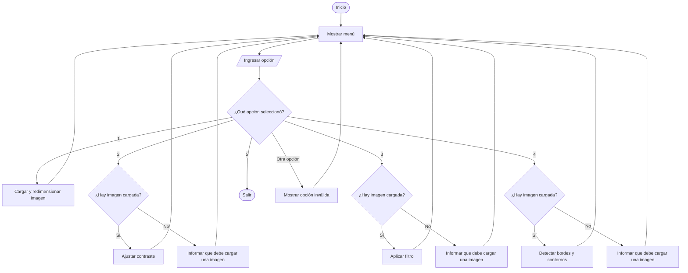

## Diagrama de flujo del menú

```mermaid
flowchart TD
    inicio([Inicio]) --> menu[Mostrar menú]
    menu --> opcion[/Ingresar opción/]
    opcion --> decision{¿Qué opción seleccionó?}

    decision -->|1| cargar[Cargar y redimensionar imagen]
    decision -->|2| contraste{¿Hay imagen cargada?}
    decision -->|3| filtro{¿Hay imagen cargada?}
    decision -->|4| bordes{¿Hay imagen cargada?}
    decision -->|5| salir([Salir])
    decision -->|Otra opción| invalida[Mostrar opción inválida]

    cargar --> menu
    invalida --> menu

    contraste -->|Sí| ajustar[Ajustar contraste]
    contraste -->|No| error1[Informar que debe cargar una imagen]
    ajustar --> menu
    error1 --> menu

    filtro -->|Sí| aplicar[Aplicar filtro]
    filtro -->|No| error2[Informar que debe cargar una imagen]
    aplicar --> menu
    error2 --> menu

    bordes -->|Sí| detectar[Detectar bordes y contornos]
    bordes -->|No| error3[Informar que debe cargar una imagen]
    detectar --> menu
    error3 --> menu
```

